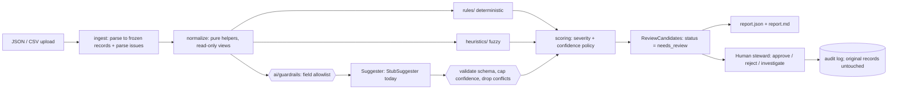

# Architecture

```mermaid
flowchart LR
  IN[JSON / CSV upload] --> ING[ingest: parse to frozen records + parse issues]
  ING --> NORM[normalize: pure helpers, read-only views]
  NORM --> R[rules/ deterministic]
  NORM --> H[heuristics/ fuzzy]
  NORM --> G{{ai/guardrails: field allowlist}}
  G --> AI[Suggester: StubSuggester today]
  AI --> V{{validate schema, cap confidence, drop conflicts}}
  R --> SC[scoring: severity + confidence policy]
  H --> SC
  V --> SC
  SC --> OUT[ReviewCandidates: status = needs_review]
  OUT --> REP[report.json + report.md]
  OUT --> HUM[Human steward: approve / reject / investigate]
  HUM --> AUD[(audit log; original records untouched)]
```

## Data flow
## Where a real LLM would plug in (and its safeguards)
## Why each check is a rule, a heuristic, or AI
